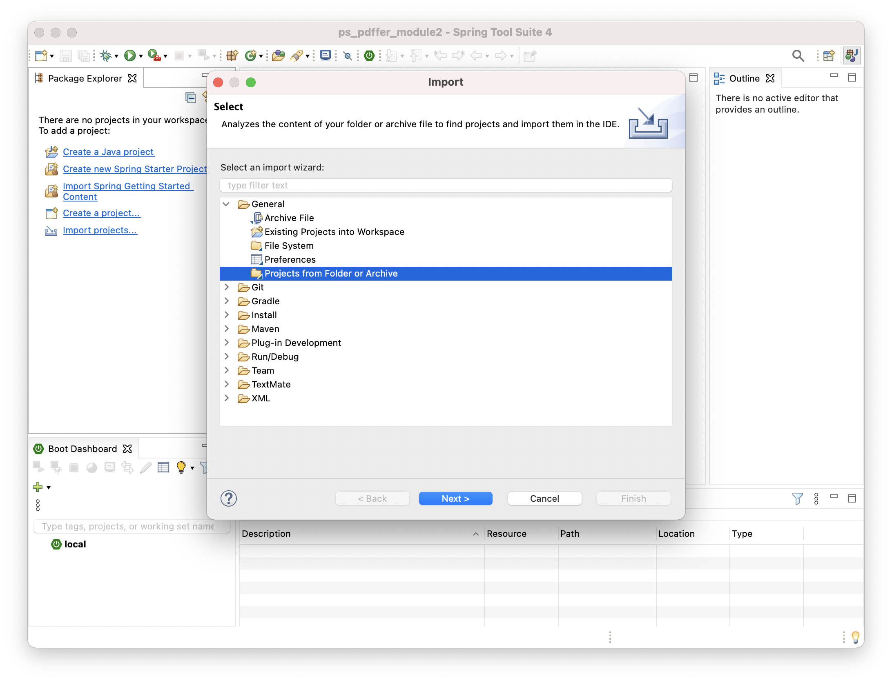
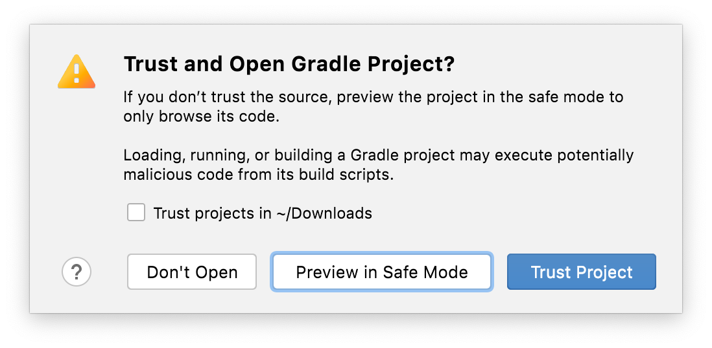

PDFfer for PluralSight
======================

The projects contain build files for both Maven and Gradle.

I have used the Maven files with Spring ToolSuite 4 for Eclipse and the
Gradle files with IntelliJ Ultimate 2021.2, but it really does not matter,
they should work all work in either IDE and with different versions too.

Eclipse with Maven
-----------------

In order to use the Maven files with Eclipse STS 4, follow these simple steps:

1. Create a new workspace

2. Open the import wizard to add projects from folder or archive

3. Click on the _Archive..._ button and select the ZIP file for the module
you are about to study. This will present a choice of 4 possible projects.
Only choose the ones that can be imported as _Maven_ projects.

4. You projects will be imported and built. As soon as all background jobs
are completed, you are ready to start following the lectures and demos in
the PluralSight module!

IntelliJ with Gradle
--------------------

The Gradle projects are all contained inside of a root Gradle project
represented by the top-level `settings.gradle` file.

In order to use the Gradle files with IntelliJ, first of all extract the ZIP
file for the module you are about to study where you want the project to be.

Then simply follow these steps

1. Create a new _Project from Existing Sources..._

2. Select the `settings.gradle` file from the unzipped course files

3. If it asks, you can trust this project

4. If you want to keep the project you were working on before open, then 
choose _New Window_, otherwise choose _This Window_ and your previous project
will be closed to make room for this new one

5. If you get this little pop-up in the bottom-right corner, choose to _Use Services_
so your boot application will be listed in the _Services_ view

6. You projects will be imported and built. As soon as all background jobs
   are completed, you are ready to start following the lectures and demos in
   the PluralSight module!

